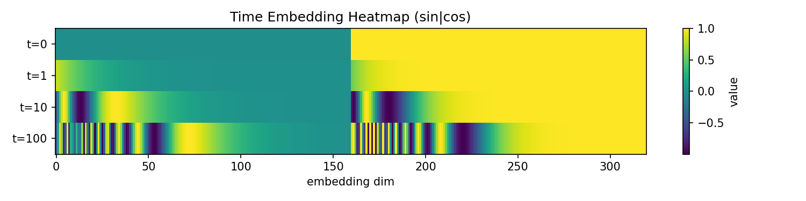

# Denoising Diffusion Probabilistic Models (DDPM) — Linear Noise Scheduler

A minimal, math-first summary of DDPM (Ho et al., 2020) with a **linear β schedule**.  
Use this as a reference for implementing training and sampling loops.

---

## Notation

- $x_0$: clean data (e.g., images)  
- $x_t$: noised sample at step $t$  
- $\epsilon \sim \mathcal N(0,\mathbf I)$: Gaussian noise  
- $t \in \{1,\dots,T\}$: diffusion timestep (paper uses 1-based; code below is 0-based)  
- $\beta_t \in (0,1)$, $\alpha_t = 1-\beta_t$, $\bar\alpha_t = \prod_{s=1}^t \alpha_s$

---

## Linear Beta Schedule

$\beta_t = \beta_{\text{start}} + \frac{t-1}{T-1}\left(\beta_{\text{end}} - \beta_{\text{start}}\right)$

Common choices in practice:  
$\beta_{\text{start}}\in[10^{-4},10^{-3}]$, $\beta_{\text{end}}\in[0.02,0.05]$.

---

## Alphas and Cumulative Product

$\alpha_t = 1-\beta_t,\quad \bar\alpha_t = \prod_{s=1}^{t}\alpha_s$

Precompute $\{\alpha_t\}_{t=1}^T$ and $\{\bar\alpha_t\}_{t=1}^T$ once.

---

<!-- @import "[TOC]" {cmd="toc" depthFrom=1 depthTo=6 orderedList=false} -->

## Forward (Diffusion) Process *(Ho et al., Eq. 4)*

$q(x_t\mid x_0)=\mathcal N\!\big(x_t;\ \sqrt{\bar\alpha_t}\,x_0,\ (1-\bar\alpha_t)\mathbf I\big) $  
$x_t=\sqrt{\bar\alpha_t}\,x_0+\sqrt{1-\bar\alpha_t}\,\epsilon $

---

## Reverse (Denoising) Mean *(Ho et al., Eq. 11)*

Let $\epsilon_\theta(x_t,t)$ be the network that predicts the added noise.  
Then the mean of the reverse transition $p_\theta(x_{t-1}\mid x_t)$ is

$\mu_\theta(x_t,t) = \frac{1}{\sqrt{\alpha_t}}\!\left(x_t - \frac{\beta_t}{\sqrt{1-\bar\alpha_t}}\,\epsilon_\theta(x_t,t)\right) $.

---

## Posterior (Sampling) Variance *(Ho et al., Eq. 15)*

$\sigma_t^2 = \tilde\beta_t = \frac{1-\bar\alpha_{t-1}}{1-\bar\alpha_t}\,\beta_t,\quad (\text{with }\bar\alpha_0:=1) $

At $t=1$, sampling often uses $\sigma_1^2=\tilde\beta_1$; at $t>1$, sample
$x_{t-1}\sim\mathcal N(\mu_\theta,\sigma_t^2\mathbf I)$.

---

## Minimal PyTorch Snippets

### 0) Schedules (0-based indexing in code)

```python
import torch

device = torch.device("cuda" if torch.cuda.is_available() else "cpu")

T = 1000
beta_start, beta_end = 1e-4, 0.02

betas = torch.linspace(beta_start, beta_end, T, device=device)     # [T]
alphas = 1.0 - betas                                              # [T]
alphas_cumprod = torch.cumprod(alphas, dim=0)                     # \bar{α}_t
alphas_cumprod_prev = torch.cat([torch.tensor([1.0], device=device), alphas_cumprod[:-1]])

# Useful square-roots
sqrt_alphas_cumprod = torch.sqrt(alphas_cumprod)
sqrt_one_minus_alphas_cumprod = torch.sqrt(1.0 - alphas_cumprod)

# Posterior variance (tilde beta)
posterior_variance = betas * (1.0 - alphas_cumprod_prev) / (1.0 - alphas_cumprod)

# (Optional) numerical safety
eps = 1e-12
alphas_cumprod = torch.clamp(alphas_cumprod, min=eps, max=1.0)
sqrt_alphas_cumprod = torch.sqrt(alphas_cumprod)
sqrt_one_minus_alphas_cumprod = torch.sqrt(torch.clamp(1.0 - alphas_cumprod, min=eps))
```

---

## Visualizations

This repo includes a script to visualize key components and save figures to `artifacts/`. Run:

```bash
python scripts/visualize_components.py --device cpu --outdir artifacts
```

You can skip parts with `--skip time mhsa mhca down` and use `--device cuda` if available.

### Time Embedding



- Shows sinusoidal time embeddings for timesteps `[0, 1, 10, 100]` across 320 dims.  
- Brighter bands indicate higher magnitude; the structure reflects sin/cos at different frequencies.  
- At `t=0`, the sin half is 0 and the cos half is 1.


- Line plot of the first 64 embedding dimensions for the same timesteps.  
- Lower-frequency components vary slowly with `t`, higher-frequency components vary rapidly.

### Self-Attention (MHSA)


- Left: attention weights without causal mask. Right: with causal mask (upper triangle suppressed).  
- Rows are queries, columns are keys; color is attention probability.  
- Causal masking prevents attending to future positions, shifting weight mass to the left of the diagonal.


- Another head may focus on different relative positions. Differences across heads illustrate multi-head diversity.

### Cross-Attention (MHCA)


- Attention from query tokens (rows) to context tokens (columns).  
- High-probability columns indicate which context positions inform each query most strongly.


- Different heads often specialize in different alignment patterns between query and context.

### UNet Downsampling Block


- Left: input channel 0 feature map (e.g., a simple gradient).  
- Right: output channel 0 after residual+attention processing and stride-2 downsampling.  
- Spatial resolution halves, channel count matches `out_channels`.

---

## Reproducing Figures

- Ensure dependencies are installed (e.g., `matplotlib`, `torch`).  
- Generate all figures: `python scripts/visualize_components.py --outdir artifacts`  
- Use `--skip` to control which figures are saved.  
- For CUDA, pass `--device cuda` if a GPU is available.
